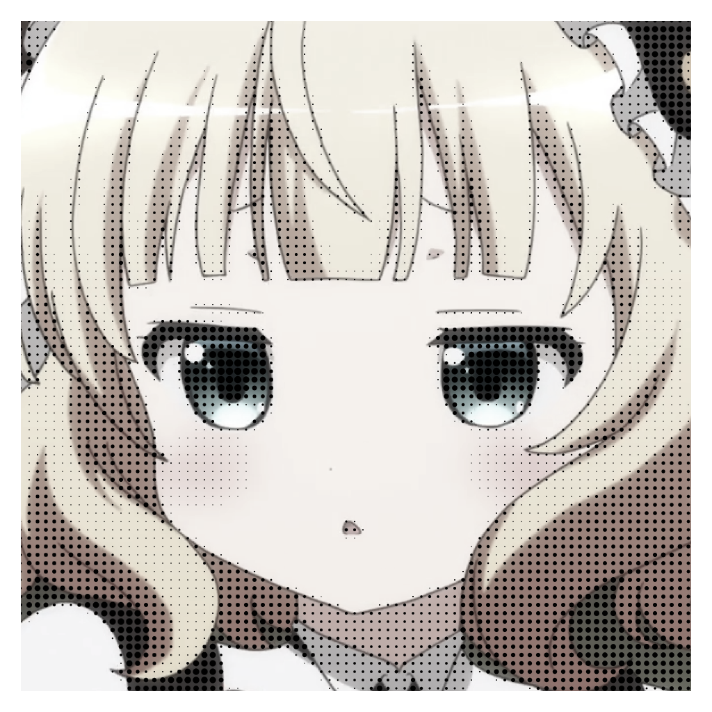

  
    
  
  $\Huge\mathbf{\overset{きり}{桐}\overset{ま}{間}}$ Kirima

----

  

  

----

> 
> 
> I use
>  
>  for Unity
> 
>  for Minecraft Plugin
>
>  for Minecraft Plugin
> 
>  for AI
> 
>  for Baekjoon
> 
> 
